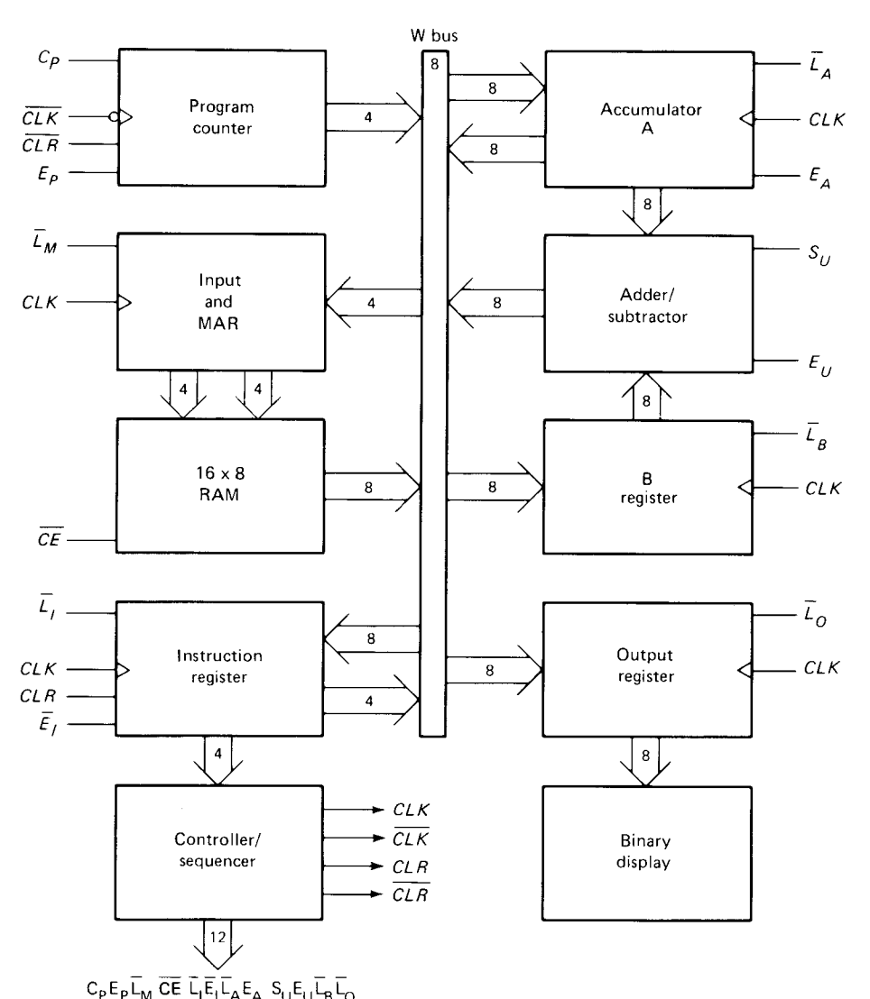

# SAP1 - Simple As Possible Processor 1

A minimal educational CPU/project that implements the SAP-1 architecture concepts in VHDL. This repository is based on the book "Digital Computer Electronics" by Malvino and was created with the aim of making a replica of the legendary Intel 8080 chip. It contains code, documentation, and examples to build, simulate, and learn from a very small computer design.

## Features
- Basic instruction set (load, add, output, etc.)
- Simple register and bus implementation
- Clock and timing control for step-by-step execution
- Assembler and example programs

## Getting Started
1. Clone the repository.
2. Read the examples in the `examples/` folder.
3. Use the simulator script or run the provided tests to step through instructions.

## Architecture

## Module Overview
- `sap1.vhd` - top-level VHDL design that integrates the CPU datapath, control unit, memory interface, display output, and clock.
- `control_unit.vhd` - finite state machine that generates control signals for instruction fetch, decode, execute, and memory operations.
- `program_counter.vhd` - simple 4-bit program counter with increment and load capability.
- `register.vhd` - generic load-enable register used for A, B, MAR, IR, and other register stages.
- `alu.vhd` - arithmetic logic unit performing addition and subtraction with carry output.
- `ram.vhd` - small synchronous 16x8 RAM module for data and program storage.
- `ram_ip_inst.vhd` - instantiation wrapper for FPGA-block RAM IP when targeting a device with a built-in memory primitive.
- `clock.vhd` - clock generator that selects between manual clock and board clock and halts output when the CPU is stopped.
- `bin2bcd.vhd` - binary-to-BCD converter used for driving seven-segment display values.
- `output.vhdl` / `output_disp.vhdl` - output register and display interface that convert internal values to displayable digits.
- `ring_counter.vhd` - ring counter used for timing or debug sequencing in the design.

## Structure
- `src/` - implementation of CPU components
- `sim/` - simulator and runner scripts
- `examples/` - sample programs and usage
- `docs/` - additional documentation and diagrams

## Contributing
Contributions are welcome. Open issues for bugs or feature requests and submit pull requests for improvements.
